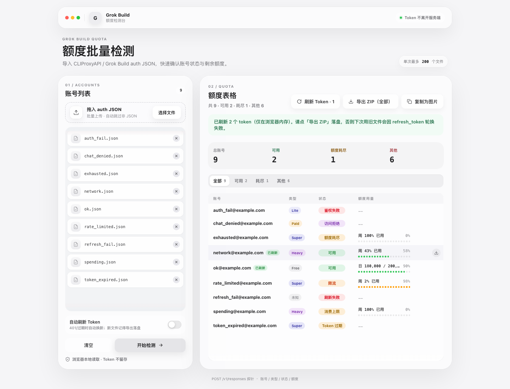

# Grok Build Quota

<p align="center">
  
</p>

批量检测 Grok Build / CLIProxyAPI 账号的额度状态。拖入一批 auth JSON，服务端逐个探针，前端只回显「账号 · 类型 · 状态 · 额度」，token 不落盘、不出服务端。

技术栈：

- **Leptos 0.8** + cargo-leptos，Actix 承载 SSR + hydration
- **Server Functions** 跑服务端探针，浏览器只发文件内容、只收检测结果
- **UnoCSS CLI** 生成工具类 CSS

## 功能

- **批量导入**：拖拽或选择多个 auth JSON，自动跳过非 JSON 文件
- **服务端探针**：`POST /v1/responses`（模型 `grok-4.5`）判定可用性，配合 `/settings`、`/user`、`/billing` 识别账号类型与用量
- **细分状态**：可用 / 额度耗尽 / 限流 / 消费上限 / 鉴权失败 / 访问拒绝 / 已禁用 / Token 过期 / 刷新失败 / 无效文件 / 网络错误
- **账号类型**：Free、SuperGrok Lite / Super / Heavy、其它付费；Free 显示日额度，付费显示周/月用量百分比
- **Token 刷新**：可选「自动刷新」开关（401 或过期时用 `refresh_token` 换新），也可对「Token 过期」的行手动刷新
- **逐行重试**：网络错误或失败的行可单独再探一次
- **结果导出**：一键复制为 PNG（失败回退下载）；导出 ZIP 落盘刷新后的新 token
- **按状态筛选**：结果表可按状态过滤后再导出

> 安全边界：刷新只写浏览器内存，服务端不落盘。原文件的 `refresh_token` 一旦被轮换，旧文件下次会失效——刷新后请务必「导出 ZIP」落盘新文件。

## 开发

```bash
# 依赖（packageManager 指定 pnpm；corepack 按该字段取版本）
corepack enable
cargo install cargo-leptos --locked
rustup target add wasm32-unknown-unknown
pnpm install

# 开发：UnoCSS watch + cargo leptos watch 并行（predev 会先生成一次 CSS）
pnpm dev

# 发布构建：先 UnoCSS，再 cargo leptos build --release
pnpm build
```

打开 http://127.0.0.1:3737

`pnpm dev` 会同时跑：

- `css:watch`：扫描 `src/**/*.rs` 里的工具类，热更新 `style/uno.css`（cargo-leptos 再吃进站点 CSS）
- `cargo leptos watch`：SSR / WASM 热重载

单独只编样式：`pnpm css` / `pnpm css:watch`。

需要走代理时（代理环境变量会传给 leptos 子进程）：

```bash
HTTPS_PROXY=http://127.0.0.1:7890 pnpm dev
```

## 代码质量

Leptos 官方推荐工具链（nightly，组件已在 `rust-toolchain.toml` 声明）：

- `rustfmt`（`rustfmt.toml`）：Rust 代码格式化
- `clippy`（`Cargo.toml [lints]`）：`all` 组 warn + 禁 `unsafe_code`
- `leptosfmt`（`leptosfmt.toml`）：`view!` 宏 RSX 格式化，`cargo install leptosfmt --locked`

```bash
pnpm fmt        # 格式化：leptosfmt src 递归格式化 view! 宏，再 cargo fmt 收尾
pnpm fmt:check  # 只检查不写入
pnpm lint       # clippy，-D warnings 作为质量门
pnpm check      # fmt:check + lint
```

`view!` 宏只在 `src/` 下，脚本传 `src` 让 leptosfmt 递归格式化（避开 `target/` 里的生成代码），`cargo fmt` 再负责整个 crate 的常规 Rust 代码。批处理下两者分两趟跑，先 `leptosfmt` 后 `cargo fmt`——顺序不能反，否则会在个别链式调用上互相打架。

编辑器里保存即格式化：项目已带 `rust-analyzer.toml`，把 rust-analyzer 的 rustfmt 命令覆写为 `leptosfmt --stdin --rustfmt`（leptosfmt 格式化后管道交给 rustfmt，一步到位）。此特性需 rust-analyzer ≥ 2024-06-10。

## Docker

只需 **2 个基础镜像**（`rust:bookworm` 构建 + `debian:bookworm-slim` 运行）。

```bash
# 需要 BuildKit（默认开启）以复用 cargo 缓存
docker compose up -d --build

# 日志 / 停止
docker compose logs -f
docker compose down
```

容器内进程双栈 bind（`0.0.0.0` + `::`），compose 显式发布 IPv4 / IPv6 到 `3737`。

**构建策略（体积优先，速度不丢）**：

- **产物**：服务端 fat LTO + strip；WASM `opt-level=z` + strip + `wasm-opt`（binaryen 131）
- **速度**：`mold` 只链 Linux host；BuildKit 缓存 registry/git/target；`cargo-leptos` 钉版本
- **层顺序**：`pnpm install` 不依赖 `src`，改 Rust 不会重装 Node 依赖

**耗时预期**：首次会下载 nightly toolchain、编译 `cargo-leptos` 与依赖，偏慢；二次构建靠 cache mount，通常只重编本项目。

预构建镜像发布在 GHCR（`ghcr.io/<owner>/grok-build-quota`），随 `main` 与 `v*` tag 自动推送。

## 工作原理

1. 浏览器读取 auth JSON，通过 Server Function 把文件内容发到服务端
2. 服务端解析 token，按需刷新，探针 `/v1/responses` 并结合 `/billing` 判定状态与额度
3. 响应只返回检测结果，**不返回 token**；刷新后的新 auth 仅在浏览器内存，导出 ZIP 时才落盘
4. 图片导出用 Canvas 绘制结果表写入系统剪贴板，失败时回退下载 PNG

## 部署模型与安全边界

本工具默认按**自用 / 可信内网**设计，开箱即用，**不内置访问鉴权**。

### Token 生命周期（确定）

| 阶段 | Token 是否可见 | 是否落盘 |
|------|----------------|----------|
| 浏览器读取本地 auth JSON | 仅本机 | 否（读入内存） |
| Server Function 请求体 | **服务端进程内存瞬时可见** | 否 |
| 探针 / OAuth 刷新 | 服务端向 xAI 代发 | 否 |
| 检测响应 | 不回传 token | — |
| 刷新成功后的新 auth | 仅浏览器内存（`updated_content`） | 否，直到你点「导出 ZIP」 |

结论：服务端**不写盘、不回传 token**，但在单次请求处理期间**一定见得到** access / refresh token。这不是「端到端加密」模型，而是「服务端代探、结果脱敏」模型。

### 适合 / 不适合

- **适合**：本机 `cargo leptos watch`、Docker 只绑 `127.0.0.1`、仅自己或完全信任的内网同事使用。
- **不适合（当前版本）**：把实例裸奔在公网、给不信任的第三方当 SaaS。此时他人可对你的服务滥用上游额度探测，且若日志/崩溃转储配置不当，可能留下瞬时 token 痕迹。

### 若需要分享给别人（文档建议，代码未强制）

1. 用反向代理（Caddy / nginx / Cloudflare Access 等）加 HTTP 基本认证或 SSO，**不要**直接暴露 3737。
2. 关闭或限制访问日志里的 request body；本应用本身不落 token 文件，但上游代理默认日志可能记 URL/状态码。
3. 需要更强隔离时：每人自建实例，或仅在受控 VPN 内访问。

上游错误文案与 code 集中在 `src/check/ssr/markers.rs`（常量表 + 观测日期注释）。xAI 改接口时优先改该文件并补单测。

## 许可证

本项目以 [AGPL-3.0-only](./LICENSE) 发布。

- 可以商用、修改、分发
- **分发时必须开源**（含修改后的完整对应源码）
- **通过网络提供修改版服务时，也必须向用户提供对应源码**（AGPL §13）
- 衍生作品也须以 AGPL-3.0 发布
